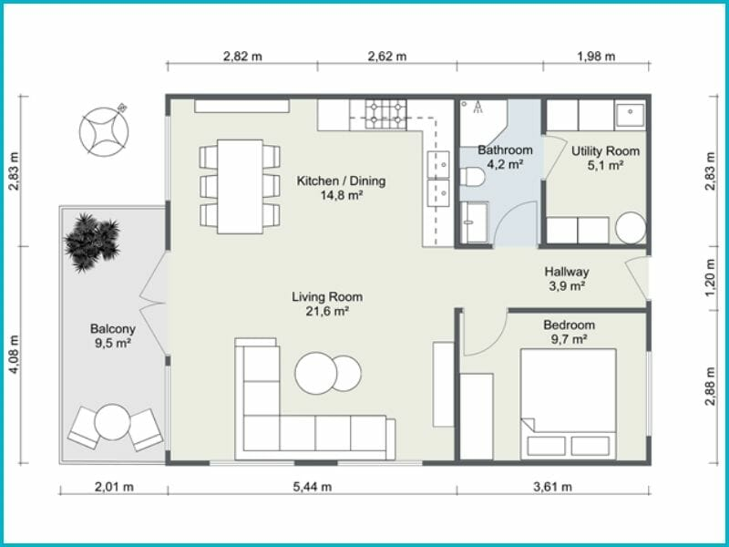

# Check Ins

Use this file to commit information clearly documenting your check-ins' content. If you want to store more information/details besides what's required for the check-ins that's fine too. Make sure that your TA has had a chance to sign off on your check-in each week (before the deadline); typically you should discuss your material with them before finalizing it here.

---

## **What is the high-level purpose of your DSL? What kind of users is it aimed at? What will it enable users to do?**

- To help develop architecture blueprints for buildings/rooms
- Render layouts for rooms and placed furniture
- Aimed towards architects and users who want to explore new ways to design their houses
- Enables them to easily layout furniture around and set colors of the rooms to visualize the whole house / floor / building

---

## **What are the 2-3 rich features of your DSL? A rich feature should be more complex than a choice in a set(e.g., the ability to choose between colours for a title is not a “rich” feature). What customisation will each feature enable? Which features can be combined to interact in useful or creative ways?**

- Ability to place floors in a building
- Each floor can have a layout of multiple rooms
- Each room can have a layout of furniture and color settings

---

## **Example snippets of your DSL that illustrate at least each rich feature, and any interesting interaction between those.**

``` md
<Building>
 <Floor 1>
  <Lobby/>
 </Floor>
 <Floor 2>
  <Residential/>
 </Floor>
 <Floor 3>
  <Residential/>
 </Floor>
</Building>

<Residential>
 <Studio x y/>
 <OneBedroom x y/>
 <OneBedroom x y/>
</Residential>

# Defines what Bedroom1 will contain
<OneBedroom color x y>
 <Bed color x y/>
 <Chair color x y/>
 <Bookshelf color x y/>
<OneBedroom1/>

# Will generate a red Bedroom1 with a position of (10, 20)
<Bedroom1 red 10 20/>
```



The following code shows how the above image might be represented.

``` md
<Bedroom>
 <Bed width=180 height=240 />
 # Note that x is relative to the position of the room, the x guarantees that the closet will always be on the left wall
 <Closet width=40 height=160 x=0/>
</Bedroom>
# and etc for Balcony, Main, Bathroom ...

<Floor>
 <Balcony x=0 y=219 width=201 height=472 />
 <Main x=201 y=0 width=544 height=691 />
 <Bathroom x=745 y=0 width=163 height=283 />
 <Utility x=908 y=0 width=198 height=283 />
 <Hallway x=745 y=283 width=361 height=120 />
 <Bedroom x=745 y=403 width=361 height=286 />
</Floor>
```

---

## **Note any important changes/feedback from TA discussion.**

- Some dynamic elements would be a nice addition
  - *ability to turn on/off the light once the building is rendered would be a good addition*
- Any output is fine, possibly an interactive UI, but an image is also good.
  - *Possibly an interactive UI*

---

## **Note any planned follow-up tasks or features still to design.**

- Figure out ways to rotate furniture
- How to place doorways
- Auto generate dimensions (ft/meter)
